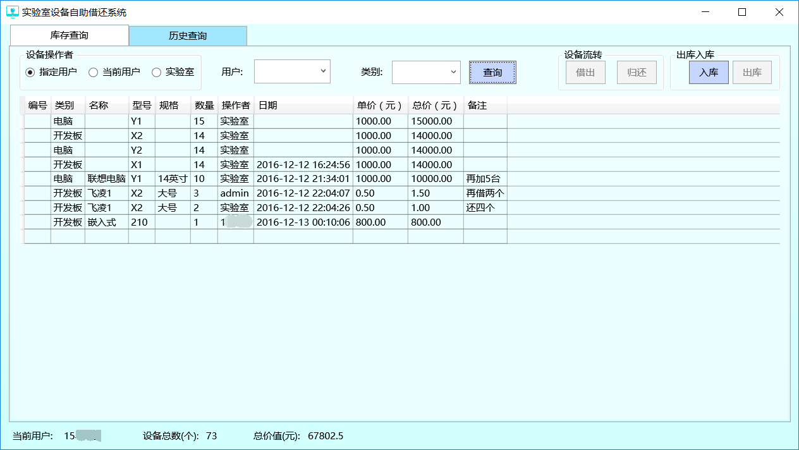
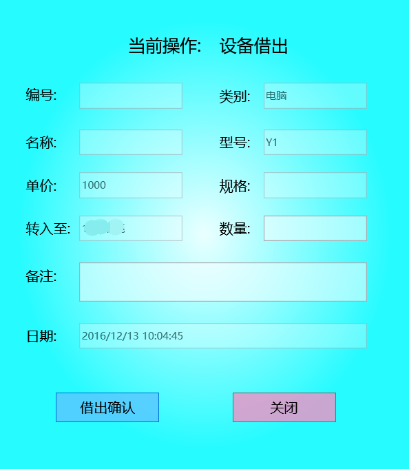
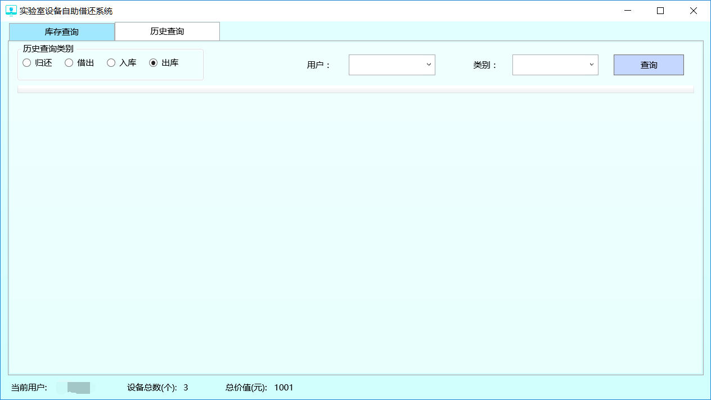
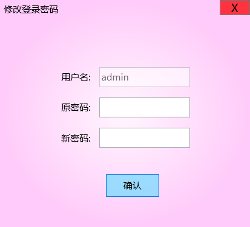

# 设备自助借还软件

实验室设备较多，人员较多，对设备进行有效的管理是一个难题，因此开发了实验室设备自助借还软件。

## 软件功能

- 用户可以通过本软件自助借还设备、器件

- 用户通过本软件可以查询特定设备的当前拥有者，也可以查询某用户所拥有的设备

- 用户通过该软件掌握设备的当前状态信息，可减少设备闲置的几率，方便设备的流转

- 用户可自行向系统仓库中添加设备以及从系统仓库中删除易消耗设备，具有高自由度

- 用户的操作历史均记录在数据库中，方便管理

- 用户可自行更改登录密码

## 技术特点

- 基于 WPF 框架和 C# 的 .NET 平台应用软件

- 设备的流通数据以及设备的详细信息由远端服务器中部署的 MySQL 数据库统一存储

- 本软件通过网络接入远端服务器的 MySQL 数据库，从而实现对数据库中上述数据的管理

## [Wiki](https://github.com/bitkylin/DeviceCirculationSystem/wiki)

该项目的详细信息请参见项目的 Wiki

### 1. [项目介绍](https://github.com/bitkylin/DeviceCirculationSystem/wiki)

### 2. [软件基本概念](https://github.com/bitkylin/DeviceCirculationSystem/wiki/软件基本概念)

### 3. [拥有设备状态查询](https://github.com/bitkylin/DeviceCirculationSystem/wiki/拥有设备状态查询)

### 4. [设备借出归还](https://github.com/bitkylin/DeviceCirculationSystem/wiki/设备借出归还)

### 5. [设备出库入库](https://github.com/bitkylin/DeviceCirculationSystem/wiki/设备出库入库)

### 6. [流转记录查询及密码修改](https://github.com/bitkylin/DeviceCirculationSystem/wiki/流转记录查询及密码修改)

## 项目展示

### [软件登录](https://github.com/bitkylin/DeviceCirculationSystem/wiki)

输入正确的用户名和密码，点击「登录」按钮进行登录操作。登录成功后即可显示软件的主界面

### [软件主界面](https://github.com/bitkylin/DeviceCirculationSystem/wiki)

所有设备/器件均包含在总仓库中，总仓库中的设备/器件均被放置在各个子仓库中。

### [设备借出](https://github.com/bitkylin/DeviceCirculationSystem/wiki/设备借出归还)

各用户均可从实验室仓库借出设备到自己的仓库中，也可以从自己的仓库中归还设备到实验室仓库中。

当用户使用非消耗品「如电脑、开发板、书籍等」时，需要将该设备从实验室仓库借出到自己的仓库中，再进行使用。使用结束后需要从自己的仓库中归还设备到实验室仓库中，禁止对非消耗品使用出库功能。

### [流转记录查询](https://github.com/bitkylin/DeviceCirculationSystem/wiki/流转记录查询及密码修改)

用户可通过该系统查看自己、实验室或其他用户的仓库，可查看自己或其他用户的归还、借出、入库、出库历史记录。

### [登录密码修改](https://github.com/bitkylin/DeviceCirculationSystem/wiki/流转记录查询及密码修改)

用户可自行修改登录密码

## [License](https://github.com/bitkylin/DeviceCirculationSystem/blob/master/LICENSE)

> MIT License
> 
> Copyright (c) 2017 123lml123
> 
> Permission is hereby granted, free of charge, to any person obtaining a copy
> of this software and associated documentation files (the "Software"), to deal
> in the Software without restriction, including without limitation the rights
> to use, copy, modify, merge, publish, distribute, sublicense, and/or sell
> copies of the Software, and to permit persons to whom the Software is
> furnished to do so, subject to the following conditions:
> 
> The above copyright notice and this permission notice shall be included in all
> copies or substantial portions of the Software.
> 
> THE SOFTWARE IS PROVIDED "AS IS", WITHOUT WARRANTY OF ANY KIND, EXPRESS OR
> IMPLIED, INCLUDING BUT NOT LIMITED TO THE WARRANTIES OF MERCHANTABILITY,
> FITNESS FOR A PARTICULAR PURPOSE AND NONINFRINGEMENT. IN NO EVENT SHALL THE
> AUTHORS OR COPYRIGHT HOLDERS BE LIABLE FOR ANY CLAIM, DAMAGES OR OTHER
> LIABILITY, WHETHER IN AN ACTION OF CONTRACT, TORT OR OTHERWISE, ARISING FROM,
> OUT OF OR IN CONNECTION WITH THE SOFTWARE OR THE USE OR OTHER DEALINGS IN THE
> SOFTWARE.

## 关于我

### 1. 我的主页

名称|二级域名|原始地址
---|---|---
主页|http://bitky.cc|https://bitkylin.github.io
GitHub|http://github.bitky.cc|https://github.com/bitkylin
简书|http://js.bitky.cc|http://www.jianshu.com/u/bd2e386a6ea8
CSDN|http://csdn.bitky.cc|http://blog.csdn.net/llmmll08

### 2. 其他

- 兴趣方向: Java, Android, C#, JavaScript, Node.js, Kotlin 等

- Email: bitkylin@163.com
